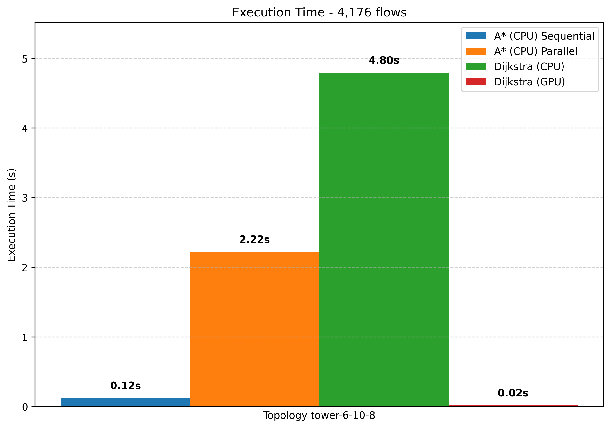
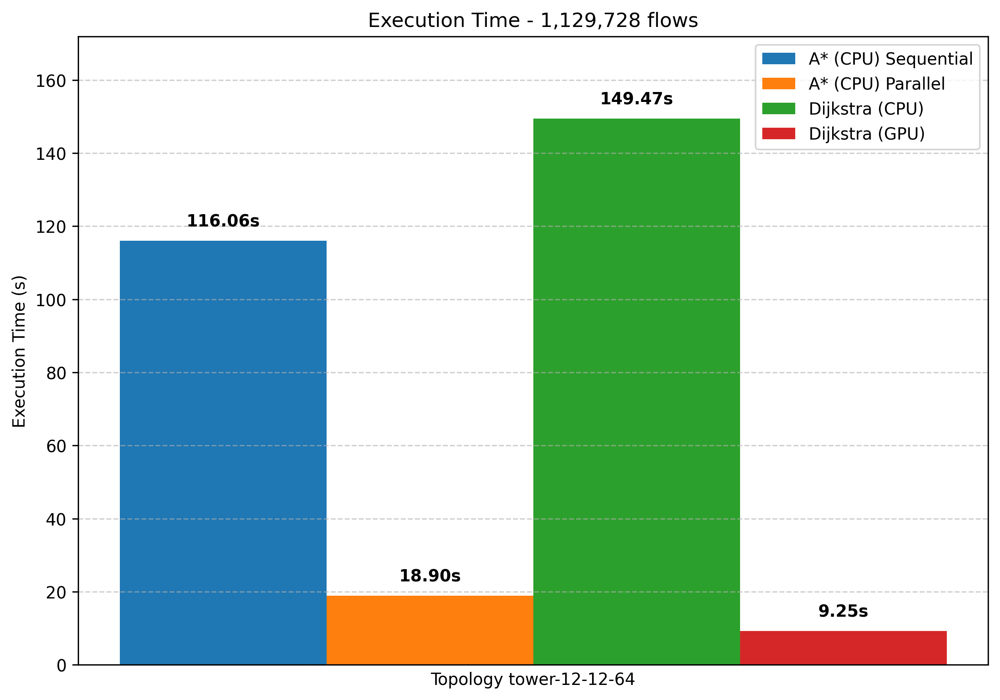

# PARALLEL ROUTING ALGORITHMS BENCHMARK

Research project benchmarking parallel computing efficiency in network routing algorithms, comparing A\* sequential/parallel implementations on CPU against Dijkstra on GPU for shortest path computation.

## Research Objective

This study evaluates the performance of different parallel processing approaches for network routing:
- **A\* Sequential vs Parallel (CPU)**: ProcessPoolExecutor-based parallelization 
- **CPU vs GPU comparison**: Dijkstra implementation on GPU using PyCUDA
- **SDN simulation**: Mininet + ONOS controller to demonstrate real-world applicability

*Note: A\* was not implemented on GPU due to heuristic complexity; Dijkstra serves as GPU baseline for shortest path algorithms.*

## Features

- **A\* Algorithm**: Sequential and parallel CPU implementations
- **Dijkstra GPU**: CUDA-accelerated shortest path computation  
- **Performance benchmarking** across multiple network topologies
- **SDN integration** with ONOS controller and Mininet simulation
- **Comprehensive analysis** of CPU parallelization vs GPU acceleration

## Requirements

### Core Dependencies
- Python 3.x
- PyCUDA (for GPU acceleration)
- ONOS Controller (for SDN simulation)
- Mininet (for network simulation)

### Python Packages
```
networkx
matplotlib
requests
python-dotenv
pycuda
numpy
```

## Installation

1. Clone repository:
   ```bash
   git clone https://github.com/wilkertl/MININET_A-_PARALLEL
   cd MININET_A-_PARALLEL
   ```

2. Install dependencies:
   ```bash
   pip install -r requirements.txt
   ```

3. Configure environment:
   ```bash
   cp .env.example .env
   # Edit .env with your ONOS settings
   ```

## Usage

### Running Benchmarks

Execute the complete benchmark suite:

```bash
python src/benchmark.py
```

This will test all algorithms across different network topologies and generate performance charts in the `benchmarks/` directory.

*Note: The benchmark uses pre-built topology files from `topologies/` directory. SDN components (ONOS/Mininet) are optional for benchmarking.*

### SDN Simulation (Optional)

For SDN integration testing:

```bash
python src/app.py
```

Available commands:
- `tower_net` - Create spine-leaf topology for testing
- `create_routes` - Install routes (sequential A\*)
- `create_routes_parallel` - Install routes (parallel A\*)
- `create_routes_pycuda` - Install routes (GPU Dijkstra)
- `delete_routes` - Remove all flows
- `ping_all` - Test full connectivity (Mininet only)
- `clean_network` - Clean Mininet and flows
- `help` - Show all commands

### Individual Algorithm Testing

```python
# A* Sequential
from router import Router
router = Router()
router.install_all_routes(parallel=False)

# A* Parallel  
router.install_all_routes(parallel=True)

# Dijkstra GPU
from router_pycuda import RouterPyCUDA
gpu_router = RouterPyCUDA()
gpu_router.install_all_routes()
```

## Configuration

Environment variables in `.env`:

```bash
ONOS_IP=127.0.0.1
ONOS_PORT=8181
ONOS_USER=onos
ONOS_PASSWORD=rocks
CONTROLERS=172.17.0.2
```

## Research Architecture

### CPU Implementation (A\*)
- **Sequential**: Single-threaded A\* pathfinding
- **Parallel**: ProcessPoolExecutor with configurable worker pool
- **Heuristic**: Precomputed distance lookup for efficiency
- **Batch Processing**: 1000 host pairs per batch

### GPU Implementation (Dijkstra)  
- **CUDA Acceleration**: PyCUDA-based parallel shortest path
- **Memory Management**: Optimized GPU memory allocation
- **Parallel Processing**: Simultaneous path computation

### SDN Integration
- **ONOS Controller**: RESTful API for flow management  
- **Mininet**: Network topology simulation
- **Performance Validation**: Real-world applicability testing

## Project Structure

```
src/
├── benchmark.py        # Main benchmark suite
├── router.py           # A\* sequential/parallel implementation  
├── router_dijkstra.py  # Dijkstra CPU implementation
├── router_pycuda.py    # Dijkstra GPU implementation
├── app.py              # SDN simulation interface
├── network.py          # Mininet topology definitions
└── onos_api.py         # ONOS controller integration

topologies/             # Network topology data (JSON)
benchmarks/             # Generated performance charts
```

## Performance Benchmarks

Comparative performance results across different network topologies:

<details>
<summary>📊 View Benchmark Results</summary>

### Small Networks (< 1K flows)


### Medium Networks (1K - 10K flows)  




### Large Networks (> 10K flows)




**Key Research Findings:**
- **GPU vs CPU**: Significant performance gains on larger networks (>10K flows)
- **CPU Parallelization**: 2-5x speedup over sequential A\* implementation  
- **Algorithm Efficiency**: A\* heuristic provides better performance than Dijkstra on most topologies
- **Scalability**: GPU acceleration becomes more effective as network size increases

</details>

## Authors

| [<br><sub>@igorjunior</sub>](https://github.com/igorjunior) | [<br><sub>@nerdola-de-cartola</sub>](https://github.com/nerdola-de-cartola) | [<br><sub>@wilkertl</sub>](https://github.com/wilkertl) |
| :---: | :---: | :---: |

## License

MIT License 